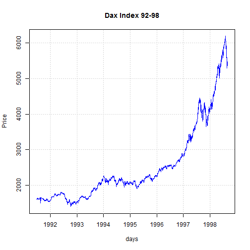
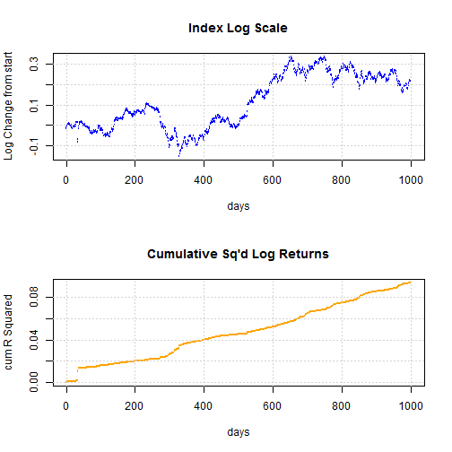
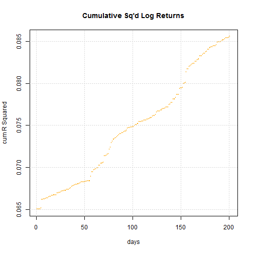
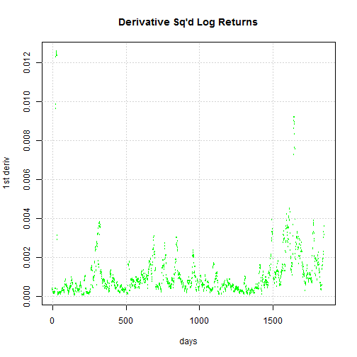

Stock Market Regimes with cumulative R-Squared
========================================================
author: Julian Cook
date: 21-Mar-2015

Introduction
========================================================

- Stock markets typically have periods of trending and sideways movement
- These are referred to as regimes
- Complex techniques are employed to model them, such as Markov Chains
- Markov Chains need to be trained on prior data to be useful

***

 

Using R Squared for simple regime detection
========================================================

- We don't need to calculate the mean or SD to calculate R Squared.
- The Log return is $$R^2 = LN\left({\frac{Price_{i+1}}{Price_i}}\right)^2$$
- and the Cumulative R  Squared calculation is $$\sum_{i=0}^n R^2$$
- The advantage is speed because $R^2$ is not averaged across a period of time.
- If the market is changing, the rate of increase will speed up or slow down.

An Example using DAX data 92-95
========================================================

- Plot shows the DAX in Log scale (blue) with the Cumulative R Squared
- Mostly $R^2$ increases at a steady rate
- Around the 300 day point $R^2$ has a significant kink
- Around the 700-900 day point there are several smaller "ripples"
- These seem to signal changes in trend or sideways movements

***

 

R Squared does not give a signal itself
========================================================

- A closer look at 700-900 days
- These are the "ripples" from the previous slide
- Remember $R^2$ always increases
- It is really the concavity or convexity that signals regime change
- So we would have to measure the second derivative

***

 

Is R Squared Useful?
========================================================

- We need the 2nd derivative (tricky)
- Easier: Look at spikes in 1st derivative instead.
- Sharp spikes match periods of change
- Calculate this in R: 

`deriv <- diff(CumSquaredRets, lag=10)`

***

 
